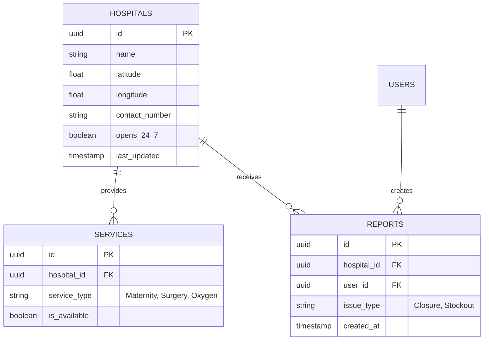

# MedFind Salone - Technical Architecture

## 📱 System Overview
MedFind Salone is designed as an **Offline-First Application**. This means the app must be fully functional (searching, viewing maps, reading hospital details) without an internet connection. Connectivity is only required for initial setup, data updates, and syncing user reports.

## 🏗 Architecture Diagram
```mermaid
graph TD
    User[Mobile User] <-->|Offline Read/Write| LocalDB[(Local Database)]
    LocalDB <-->|Sync (When Online)| SyncEngine[Sync Engine]
    SyncEngine <-->|JSON/HTTPS| BackendAPI[Supabase Edge Functions]
    BackendAPI <-->|R/W| MasterDB[(Master Database - PostgreSQL)]
    
    subgraph Client Device
        User
        LocalDB
        SyncEngine
    end

    subgraph Cloud Infrastructure
        BackendAPI
        MasterDB
    end
```

## 💾 Data Strategy

### 1. Local Database (Client)
*   **Technology**: WatermelonDB (React Native) or PouchDB (Web/PWA).
*   **Purpose**: Stores a full copy of the `Hospitals` dataset and a queue of pending User Reports.
*   **Optimization**: Hospital data is static-heavy and rarely changes, making it perfect for local caching.

### 2. Master Database (Cloud)
*   **Technology**: Supabase (PostgreSQL).
*   **Tables**:
    *   `hospitals`: Master list of facilities.
    *   `services`: Available services per hospital.
    *   `reports`: User-generated reports (e.g., "Out of Oxygen").

## 🔄 Synchronization Logic

### Pull (Cloud -> Device)
1.  App checks for `last_sync_timestamp`.
2.  If > 24 hours, request diffs from backend.
3.  Download updated `hospitals.json` or diff packet.
4.  Update LocalDB.

### Push (Device -> Cloud)
1.  User submits a report (e.g., "Facility Closed").
2.  Report saved to `verification_queue` in LocalDB.
3.  Background job detects connection.
4.  Push `verification_queue` to Supabase.
5.  On success, remove from local queue.

## 🛠 Tech Stack Recommendation
*   **Frontend**: React Native (Expo) - For true native performance on Android (dominant in SL).
*   **Maps**: Mapbox GL JS (with offline pack support) or OpenStreetMap tiles cached locally.
*   **Backend**: Supabase - Provides Auth, Database, and Edge Functions out of the box.

## 📍 Data Schema (ERD)


