# MedFind Salone - User Flow Diagrams

## 1. Patient/User Flows

### Flow A: Emergency Hospital Search (Critical Path)

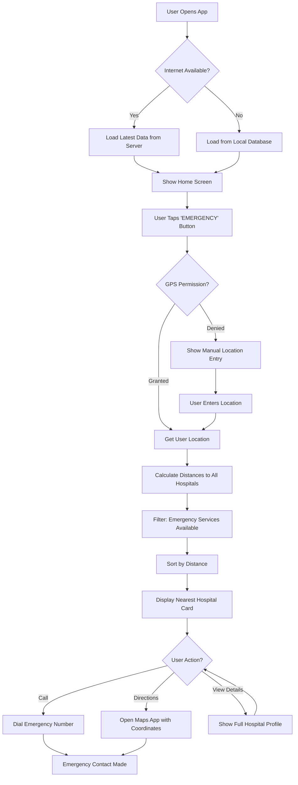

**Key Features:**
- Works 100% offline after initial data load
- GPS-based automatic location detection
- One-tap emergency call
- Fallback to manual location entry

---

### Flow B: Search by Service (Maternity Example)

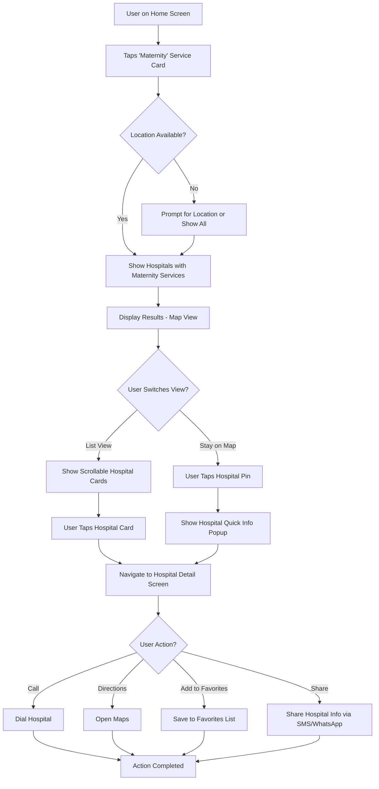

**Key Features:**
- Service-specific filtering
- Toggle between map and list views
- Favorites for quick access
- Social sharing capability

---

### Flow C: Filter & Advanced Search

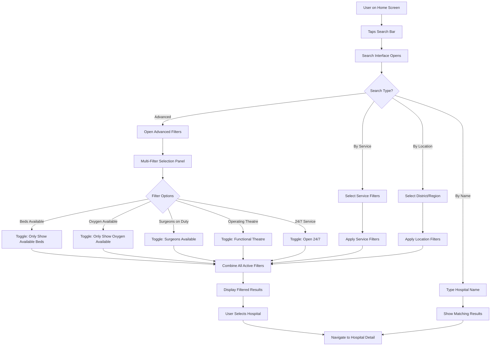

**Key Features:**
- Multiple filter combinations
- Real-time availability filtering
- District/region-based search
- Name-based quick search

---

### Flow D: Hospital Detail View & Actions

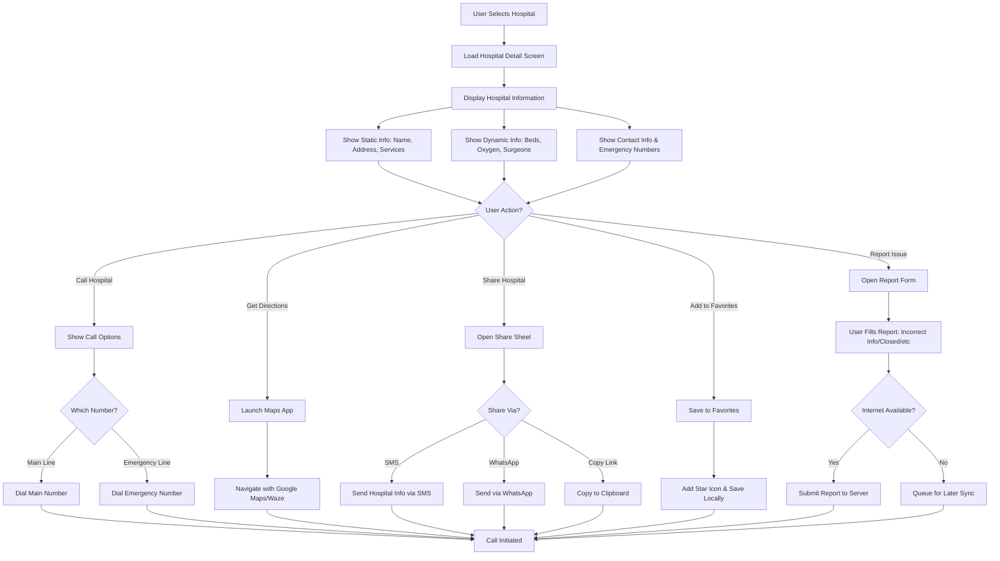

**Key Features:**
- Multiple contact options
- Integrated navigation
- Social sharing
- User-generated reports for data quality
- Offline report queuing

---

### Flow E: Favorites & Recent Access

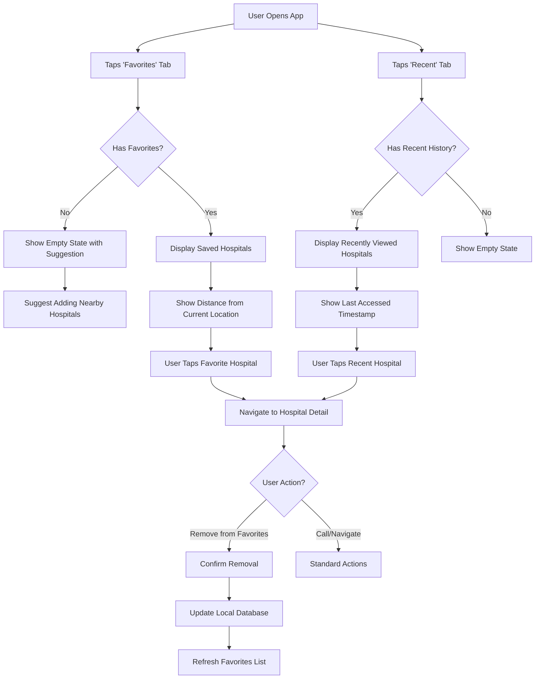

**Key Features:**
- Quick access to frequently used hospitals
- History tracking
- Distance updates based on current location

---

### Flow F: Multi-Language Support (English/Krio)

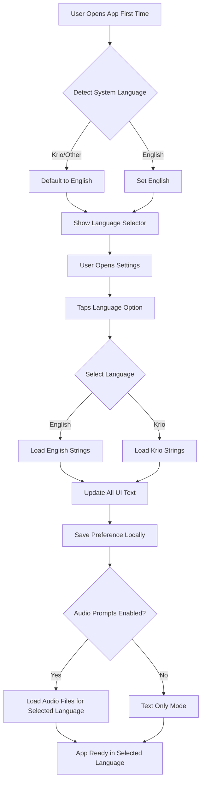

**Key Features:**
- Automatic language detection
- Easy language switching
- Optional audio prompts for low-literacy users
- Persistent language preference

---

### Flow G: Offline Sync & Data Updates

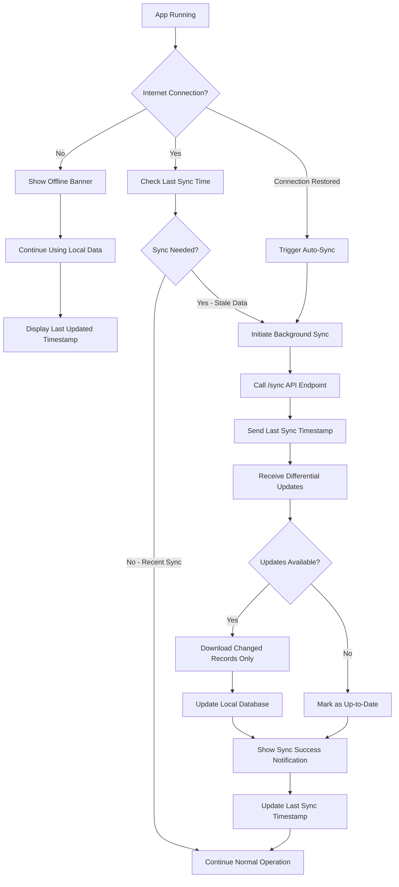

**Key Features:**
- Automatic background sync when online
- Differential updates (only changed data)
- Clear offline indicators
- Last updated timestamp display

---

## 2. Admin/Hospital Staff Flows

### Flow H: Admin Login & Authentication

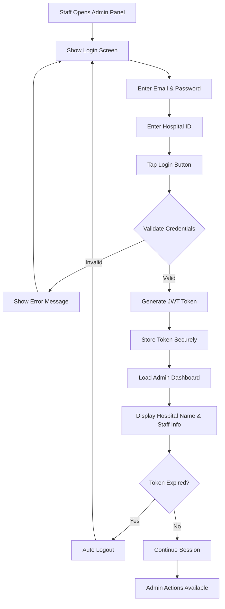

**Key Features:**
- Secure JWT-based authentication
- Hospital-specific access control
- Auto-logout on token expiry

---

### Flow I: Update Dynamic Availability (Full Update)

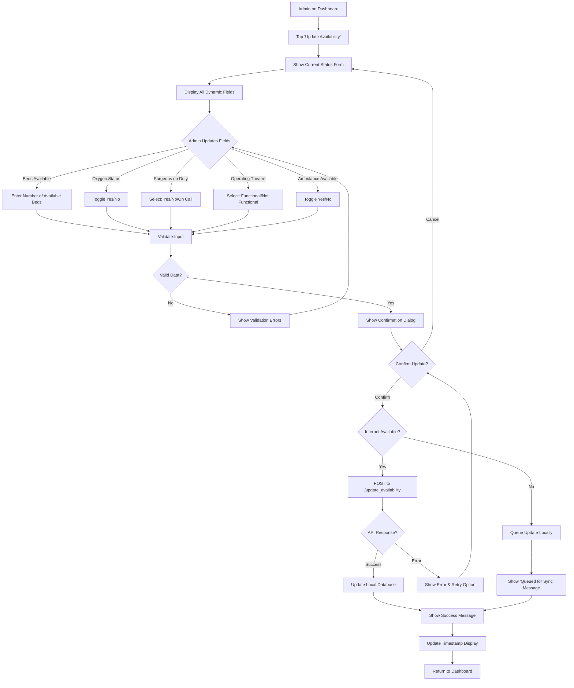

**Key Features:**
- Comprehensive form for all dynamic fields
- Input validation
- Offline queue for updates
- Confirmation before submission

---

### Flow J: Quick Update (One-Tap Updates)

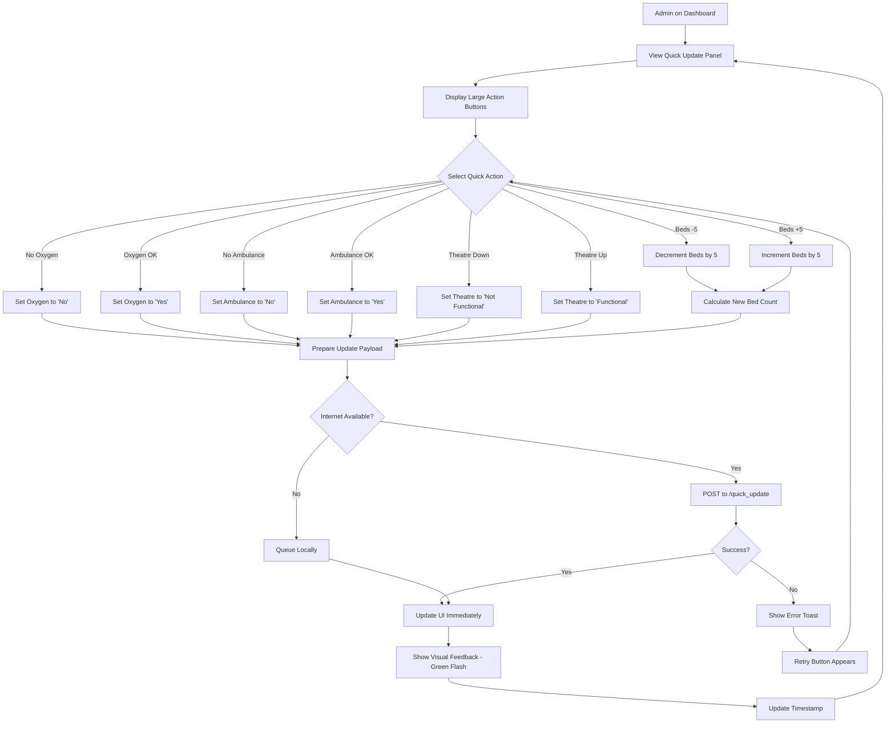

**Key Features:**
- One-tap updates for common changes
- Immediate visual feedback
- Offline queuing
- No confirmation needed (speed priority)

---

### Flow K: Admin View Analytics & History

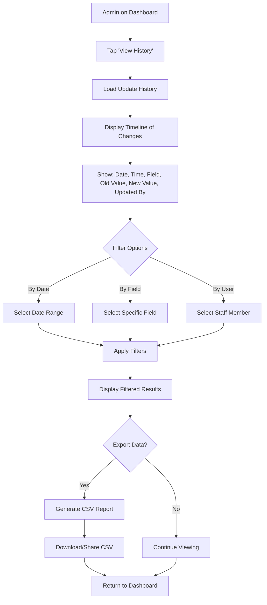

**Key Features:**
- Complete audit trail
- Filtering and search
- Export capability
- Accountability tracking

---

## 3. Emergency Mode Flows

### Flow L: SOS Emergency Mode

```mermaid
flowchart TD
    A[User in Distress] --> B[Opens App]
    B --> C[Taps Large Red 'SOS' Button]
    C --> D[Activate Emergency Mode]
    D --> E[Screen Turns Red with Pulsing Animation]
    E --> F{GPS Available?}
    F -->|Yes| G[Get Precise Location]
    F -->|No| H[Use Last Known Location]
    G --> I[Find Nearest Hospital with Emergency Services]
    H --> I
    I --> J[Display Hospital in Large Text]
    J --> K[Show Distance & Estimated Time]
    K --> L[Display Emergency Number in HUGE Font]
    L --> M{User Action - Auto-prompt after 3 seconds}
    M -->|Call Now| N[Auto-dial Emergency Number]
    M -->|Send Location SMS| O[Prepare SMS with Location]
    M -->|Get Directions| P[Launch Maps with Route]
    N --> Q[Call Connected]
    O --> R[Select Emergency Contact]
    R --> S[Send: 'EMERGENCY at [Hospital Name], [Address], [Maps Link]']
    P --> T[Turn-by-Turn Navigation Starts]
    Q --> END[Help on the Way]
    S --> END
    T --> END
```

**Key Features:**
- High-contrast emergency UI
- Auto-prompt for action
- One-tap emergency call
- Location sharing via SMS
- Works offline with cached data

---

### Flow M: Voice-Activated Emergency (Future Enhancement)

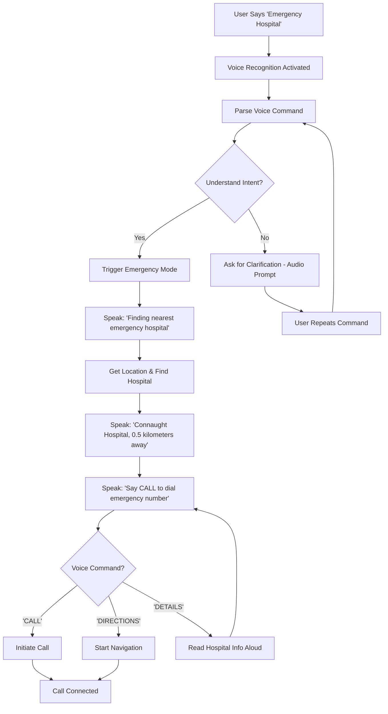

**Key Features:**
- Hands-free operation
- Audio feedback in selected language
- Voice commands for actions
- Accessibility for visually impaired users

---

## 4. System Flows

### Flow N: First-Time App Setup

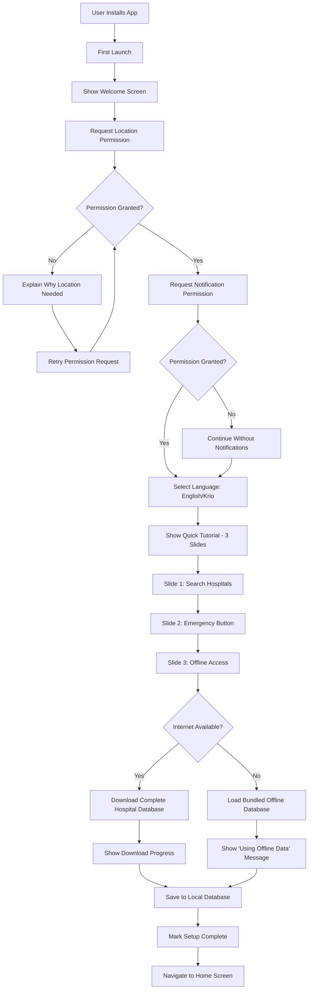

**Key Features:**
- Permission requests with explanations
- Quick onboarding tutorial
- Automatic data download
- Bundled offline database as fallback

---

### Flow O: Background Sync Process

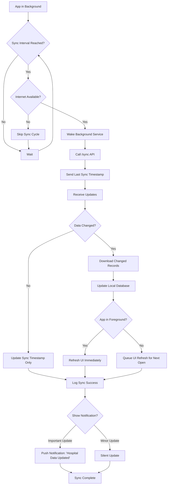

**Key Features:**
- Periodic background sync (every 30 min)
- Battery-efficient (only when online)
- Smart notifications
- UI refresh handling

---

## User Journey Summary

### Critical User Journeys (Must Work Offline)

1. **Emergency Search**: Home → Emergency Button → Nearest Hospital → Call (3 taps)
2. **Service Search**: Home → Service Card → Hospital List → Details → Call (4 taps)
3. **Favorites Access**: Home → Favorites → Hospital → Call (3 taps)

### Average Time to Emergency Contact
- **Target**: < 10 seconds from app open to call initiated
- **Offline**: 100% functional
- **Online**: Enhanced with real-time availability

---

*Document Version: 1.0*  
*Last Updated: 2025-12-13*
